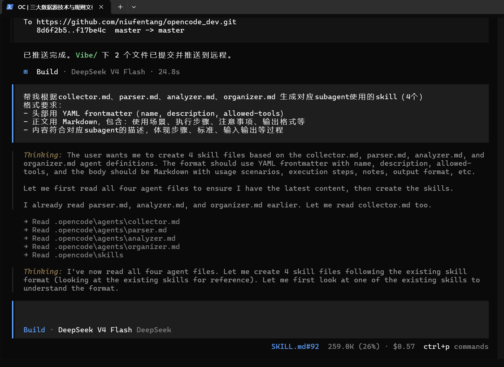
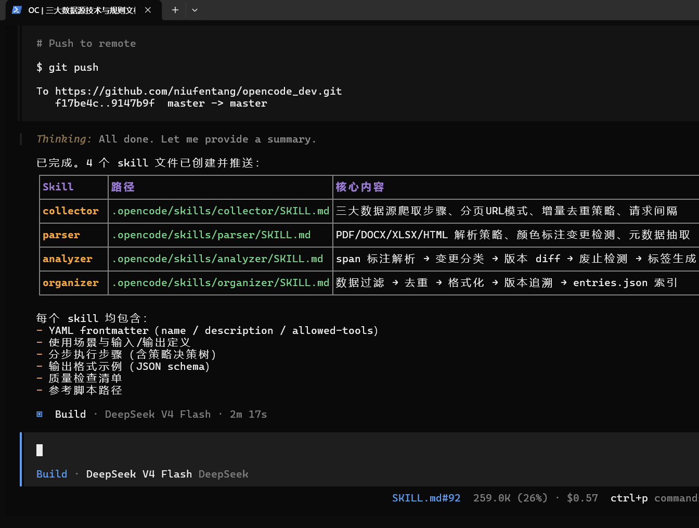

帮我根据collector.md、parser.md、analyzer.md、organizer.md 生成对应subagent使用的skill（4个）
格式要求：
- 头部用 YAML frontmatter（name, description, allowed-tools）
- 正文用 Markdown，包含：使用场景、执行步骤、注意事项、输出格式等
- 内容符合对应subagent的描述，体现步骤、标准、输入输出等过程

