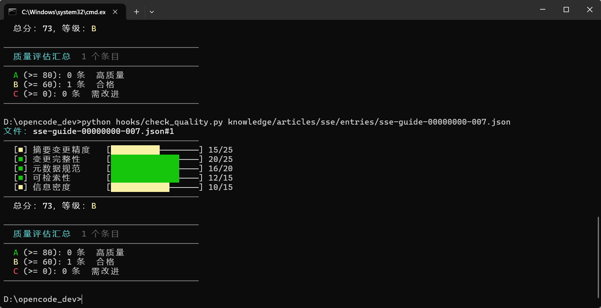

### 用 AI 编程工具生成 validate_json.py
提示词
```
请帮我编写一个 Python 脚本 hooks/validate_json.py，用于校验知识条目 JSON 文件
具体要求请当前项目主AGENT和SUBAGENT，给出

```

输出:

[alidate-json-hook-requirements.md](../doc/validate-json-hook-requirements.md)

脚本内容如下：
[validate_json.py](../hooks/validate_json.py)


---

提示词

```
请帮我编写一个 Python 脚本 hooks/check_quality.py,用于给知识条目做 5 维度质量评分：

需求：
1. 支持单文件和多文件（通配符 *.json）两种输入模式
2. 使用 dataclass 定义 DimensionScore 和 QualityReport 结构
3. 5 个评分维度及满分（加权总分 100 分）：
   - 摘要质量 (25 分)：>= 50 字满分，>= 20 字基本分，含技术关键词有奖励
   - 技术深度 (25 分)：基于文章 score 字段（1-10 映射到 0-25）
   - 格式规范 (20 分)：id、title、source_url、status、时间戳五项各 4 分
   - 标签精度 (15 分)：1-3 个合法标签最佳，有标准标签列表校验
   - 空洞词检测 (15 分)：不含"赋能""抓手""闭环""打通"等空洞词
4. 空洞词黑名单分中英两组：
   - 中文：赋能、抓手、闭环、打通、全链路、底层逻辑、颗粒度、对齐、拉通、沉淀、强大的、革命性的
   - 英文：groundbreaking、revolutionary、game-changing、cutting-edge 等
5. 输出可视化进度条 + 每维度得分 + 等级 A/B/C
6. 等级标准：A >= 80, B >= 60, C < 60
7. 退出码：存在 C 级返回 1，否则返回 0

编码规范：遵循 PEP 8，使用 pathlib 和 dataclass，不依赖第三方库

说明：可结合当前项目做其他补充，给出补充说明，我确定后合并进去

```

输出:
[check-quality-scoring-criteria.md](../doc/check-quality-scoring-criteria.md)

脚脚本内容如下：
[validate_json.py](../hooks/validate_json.py)

效果
