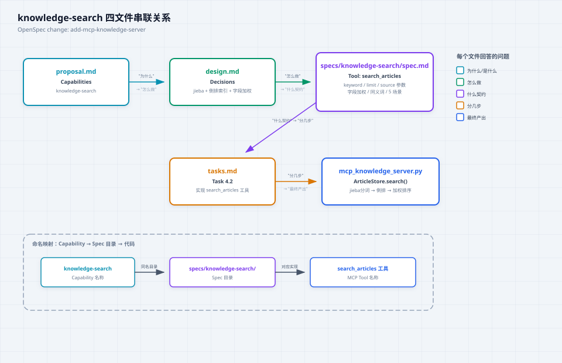

# OpenSpec 完整安装及使用全流程（适配 OpenCode）

# OpenSpec 完整安装 \&amp; 使用全流程（适配 OpenCode）

> 本文档包含：环境要求、安装步骤、项目初始化、OPSX 全生命周期操作、命令详解、目录结构、OpenCode 适配说明，可直接复制保存为 `OpenSpec\-使用手册\.md`
> 
> 

## 一、前置环境要求

1. **Node\.js 版本 ≥ 20\.19\.0**

```bash
# 校验版本
node --version
# 版本过低请前往官网下载：https://nodejs.org/
```

2. 支持编辑器：**OpenCode / Cursor / Claude Code / Trae Solo**（OpenCode 原生深度兼容）

3. 操作系统：Windows /macOS/ Linux 全平台支持

## 二、全局安装 OpenSpec CLI

### 1\. 安装命令（三选一，推荐 npm）

```bash
# npm 安装（通用）
npm install -g @fission-ai/openspec@latest

# pnpm 安装（速度更快）
pnpm add -g @fission-ai/openspec@latest

# yarn 安装
yarn global add @fission-ai/openspec@latest
```

### 2\. 验证安装成功

```bash
openspec --version
# 输出版本号（如 v1.3.x）即安装完成
```

## 三、项目初始化

### 1\. 进入项目根目录

```bash
cd 你的项目根目录
```

### 2\. 执行初始化命令

```bash
openspec init
```

### 3\. 交互配置（默认回车即可）

1. 选择 AI 工具：`OpenCode`（直接适配）/ Cursor / Claude Code

2. 变更存放目录：默认 `openspec/changes`

3. 归档目录：默认 `openspec/changes/archive`

4. 自动生成 OPSX 技能配置（OpenCode 自动识别）

### 4\. 初始化后目录结构

```Plain Text
openspec/
├─ changes/          # 进行中需求变更目录
│  └─ [变更名称]/
│     ├─ proposal.md # 为什么：需求提案、背景、范围、验收标准
│     ├─ design.md   # 怎么做：技术方案、架构、选型、风险
│     ├─ specs/      # 什么契约：接口、入参、业务规则、异常约束
│     │  └─ *.md
│     └─ tasks.md    # 分几步：开发任务拆解、步骤、优先级
└─ archive/          # 已完成需求归档目录
```

### 5\. 实际生成内容详解（`.opencode/` 目录）

执行 `openspec init` 后，还会在 `.opencode/` 下自动生成以下内容：

**4 个 commands（斜杠命令）**：

| 文件 | 命令 | 用途 |
|------|------|------|
| `commands/opsx-propose.md` | `/opsx:propose "idea"` | 发起新需求变更，生成 proposal.md |
| `commands/opsx-apply.md` | `/opsx:apply` | 按 tasks.md 任务清单编码落地 |
| `commands/opsx-archive.md` | `/opsx:archive` | 归档已完成变更至 archive |
| `commands/opsx-explore.md` | `/opsx:explore` | 探索已有变更文档 |

**4 个 skills（技能包）**：

| 目录 | 用途 |
|------|------|
| `skills/openspec-propose/` | 需求提案 Skill，引导用户填写 proposal.md |
| `skills/openspec-apply-change/` | 编码落地 Skill，严格遵循 specs 契约 |
| `skills/openspec-archive-change/` | 归档闭环 Skill，校验完整性后归档 |
| `skills/openspec-explore/` | 探索变更 Skill，查看变更状态和内容 |

**依赖安装**：

- `package.json` — 添加 `@opencode-ai/plugin` 依赖
- `node_modules/` — 安装对应插件包
- `.gitignore` — 自动生成，忽略 node_modules 等

> 执行结果示例输出：
> ```
> OpenSpec Setup Complete
> Created: OpenCode
> 4 skills and 4 commands in .opencode/
> Config: skipped (non-interactive mode)
> ```

## 四、OPSX 完整使用全流程（严格按顺序执行，适配 OpenCode）

> 所有命令直接在 OpenCode 对话框发送即可，无需额外配置
> 
> 

### 步骤 1：新建需求变更 `/opsx:new`

**命令**

```Plain Text
/opsx:new add-mcp-knowledge-server
```

**作用**
自动创建 `openspec/changes/add\-mcp\-knowledge\-server` 目录，生成 4 个空文档。
**操作**
手动编辑 `proposal\.md`，填写：业务背景、变更目的、需求范围、验收标准、不做边界。
本次实际案例为：构建一个 MCP Knowledge Server，通过标准 MCP 协议将本地知识库暴露给 AI 工具。

### 步骤 2：一键生成全套设计文档 `/opsx:ff`

**命令**

```Plain Text
/opsx:ff
```

**全称**：fast\-forward（快速推进）
**作用**
OpenCode 基于 `proposal\.md` 自动生成：

- `design\.md`：技术架构、模块拆分、技术选型

- `specs/\*\.md`：接口契约、业务约束、数据格式、异常逻辑

- `tasks\.md`：可执行开发步骤、优先级、测试要点

### 步骤 3：评审拷问校验 `grill\-me`

**命令**

```Plain Text
grill-me
```

**作用**
OpenCode 扮演评审角色，校验文档漏洞：
需求是否完整、设计是否合理、契约是否完备、任务是否可落地；根据反馈迭代修改文档。

### 步骤 4：AI 编码落地 `/opsx:apply`

**命令**

```Plain Text
/opsx:apply
```

**作用**
OpenCode 读取 `tasks\.md` 任务清单，严格遵守 `specs` 契约，自动编码、自测、补全注释，分步完成开发。

### 步骤 5：需求归档闭环 `/opsx:archive`

**命令**

```Plain Text
/opsx:archive
```

**作用**
将已完成的需求变更归档至 `openspec/changes/archive`，实现**需求 \- 设计 \- 契约 \- 实现**全链路可追溯。

## 六、openspec/specs/ 共享规格目录

### 目录定位

`openspec/specs/` 是**项目级共享规格目录**，用于存放跨多个变更复用的接口契约。与 `openspec/changes/<name>/specs/`（变更私有规格）不同，共享规格由所有变更共同引用。

### 什么时候使用

当多个 change 涉及相同的接口或契约时，将公共部分提取到 `openspec/specs/`，变更内的规格改为引用共享规格。例如：

```
openspec/
├── specs/                              ← 共享规格（项目级）
│   └── knowledge-search/
│       └── spec.md                     ← search_articles 接口约定，被多个 change 共用
├── changes/
│   ├── add-mcp-knowledge-server/
│   │   └── specs/
│   │       └── knowledge-search/
│   │           └── spec.md             ← 指向共享规格的引用（或冗余副本）
│   └── upgrade-search-to-meilisearch/
│       └── specs/
│           └── knowledge-search/
│               └── spec.md             ← 同样引用同一份共享规格
└── archive/
    └── 2026-05-30-add-mcp-knowledge-server/
        └── specs/ …                    ← 归档时保留变更当时使用的 spec 快照
```

### 好处

| 好处 | 说明 |
|------|------|
| **去重** | 接口约定只维护一份，避免多份副本不一致 |
| **一致性** | 所有 change 对同一工具/接口的描述保持一致 |
| **变更追踪** | 修改共享 spec 后，所有引用它的 change 都能追溯影响范围 |
| **解耦** | change 的私有规格仍然可以保留在 change 目录中，只提升复用部分 |

### 何时不需要

- 项目尚在早期，只有 1–2 个 change 时——过早提取共享规格反而增加理解成本
- 某个 spec 明确只属于一个 change（如一次性迁移任务的临时接口）

建议当**第三个 change 复用同一份契约**时，再执行提取。

### 文件串联关系图

以本次 `add-mcp-knowledge-server` change 的 `knowledge-search` 能力为例，展示 Capability 如何从 proposal 贯穿到最终代码：



四个文件各回答一个问题，通过 Capability 名称（`knowledge-search`）与 Spec 目录（`specs/knowledge-search/`）直接对应，最终映射到 MCP Tool 名称（`search_articles`）。

## 六、核心命令速查表

| 命令 | 类型 | 全称 | 核心作用 |
|------|------|------|---------|
| `openspec list` | CLI | list | 查看所有进行中的变更列表 |
| `openspec status <name>` | CLI | status | 查看某个变更的文档完成度 |
| `openspec validate <name>` | CLI | validate | 归档前校验文档完整性 |
| `/opsx:new` | OPSX | new | 新建需求变更，初始化文档目录 |
| `/opsx:ff` | OPSX | fast-forward | 一键生成设计、契约、任务文档 |
| `grill-me` | OPSX | — | 评审校验，卡点质量，补全文档漏洞 |
| `/opsx:apply` | OPSX | apply | OpenCode 按任务规范落地编码 |
| `/opsx:archive` | OPSX | archive | 归档完成需求，沉淀全链路文档 |

## 七、常用组合

### 前置检查（CLI 命令）

| 时机 | 命令 | 作用 |
|------|------|------|
| 写代码前 | `openspec list` | 查看当前有哪些进行中的变更 |
| archive 前 | `openspec status <name>` | 检查文档是否完整 |
| archive 前 | `openspec validate <name>` | 校验通过后再归档 |

### 开发流程（OPSX 命令）

| 场景 | 命令组合 | 说明 |
|------|---------|------|
| **完整开发流程** | `new` → `ff` → `grill-me` → `apply` → `archive` | 一个变更从创建到归档的完整生命周期 |
| **快速编码（需求明确）** | `new` → `ff` → `apply` → `archive` | 跳过 grill-me，适合简单明确的需求 |
| **仅设计（不写代码）** | `new` → `ff` → `grill-me` | 产出设计文档即可，编码由他人完成 |

> 无论哪种组合，`archive` 是最后一步，不可省略——没有归档就没有可追溯性

## 八、OpenCode 兼容说明

1. **原生无缝兼容**：OpenSpec 与 OpenCode 为官方配套体系，所有命令 100% 支持；

2. **规范强制约束**：OpenCode 会严格遵守 `specs` 契约开发，避免 AI 乱写代码；

3. **全流程自动化**：无需切换工具，一套对话完成「需求→设计→编码→归档」。

## 九、标准文档模板（直接复制使用）

### 1\. \[proposal\.md\]\(proposal\.md\) 模板

```markdown
# 需求提案：[变更名称]
## 1. 背景
业务现状、存在问题、变更动机

## 2. 目标
本次变更要解决什么问题，实现什么功能

## 3. 范围
- 包含：xxx
- 不包含：xxx（明确边界）

## 4. 验收标准
1. xxx
2. xxx

## 5. 风险点
潜在问题、依赖、约束
```

### 2\. \[tasks\.md\]\(tasks\.md\) 模板

```markdown
# 开发任务清单
## 任务1：xxx
- 优先级：P0
- 依赖：无
- 实现步骤：xxx

## 任务2：xxx
- 优先级：P1
- 依赖：任务1
- 实现步骤：xxx
```

> （注：文档部分内容可能由 AI 生成）
